# Inhaltsverzeichnis

 * [__Starten der Anwendung__](#starten-der-anwendung)
 * [__Erfassung der Verkäufer__](#erfassung-der-verkufer)  
     * [Hinzufügen eines neuen Verkäufers](#hinzufgen-eines-neuen-verkufers)
	* [Hinzufügen einer Verkäufernummer](#hinzufgen-einer-verkufernummer)
	* [Entfernen einer Verkäufernummer](#entfernen-einer-verkufernummer)        
	* [Import und Export von Kundendaten](#import-und-export-von-kundendaten)
	* [Bearbeiten eines Verkäufers](#bearbeiten-eines-verkufers)
* [__Erfassung der Artikel__](#erfassung-der-artikel) 
	* [Hinzufügen eines Artikels](#hinzufgen-eines-artikels)
	* [Import und Export von Artikeln](#import-und-export-von-artikeln) 
	* [Sortieren und Filtern](#sortieren-und-filtern)
* [__Abrechnung__](#abrechnung)
	* [Abrechnungen drucken](#abrechnungen-drucken)
	* [Alle Abrechnungen drucken](#alle-abrechnungen-drucken) 
	* [Interne Abrechnung drucken](#interne-abrechnung-drucken)
* [__Info__](#info)
* [__Shortcuts__](#shortcuts)

###Starten der Anwendung

###Erfassung der Verk&auml;ufer

Um in die Verkäufer Erfassung zu gelangen benötigt es einen Klick auf „Verkäufer“. Wird die Anwendung gestartet ist diese Maske bereits geöffnet.
Alternativ kann man auch Strg + 1 (Steuerungstaste gedrückt halten und dann die 1 drücken) um in die Verkäufer Ansicht zu gelangen.

###Hinzuf&uuml;gen eines neuen Verk&auml;ufers

Die Erfassung der Kundendaten erfolgt mit einem Klick auf den Neu-Button in der Verkäuferansicht. 
Es öffnet sich ein neues Fenster.

###Hinzuf&uuml;gen einer Verk&auml;ufernummer

Der Hinzufügen Button ermöglicht es, dem Verkäufer eine neue Verkäufernummer hinzuzufügen.
Hier zuerst im Feld „Verkäufernummer“ die jeweilige Nummer eintragen.

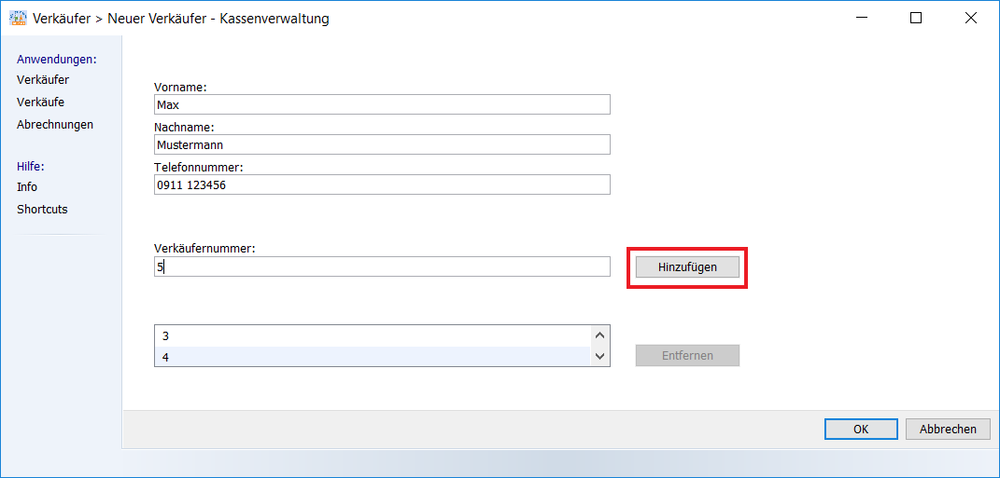

Mit Klick auf „OK“ wird der Verkäufer angelegt und die Maske schließt sich.

###Entfernen einer Verk&auml;ufernummer

Um einem Verkäufer eine Verkäufernummer zu entfernen, benötigt es einen Klick auf die jeweilige Nummer.
Der „Entfernen“ Button wird aktiviert und mit Klick auf den Button wird die Nummer entfernt.

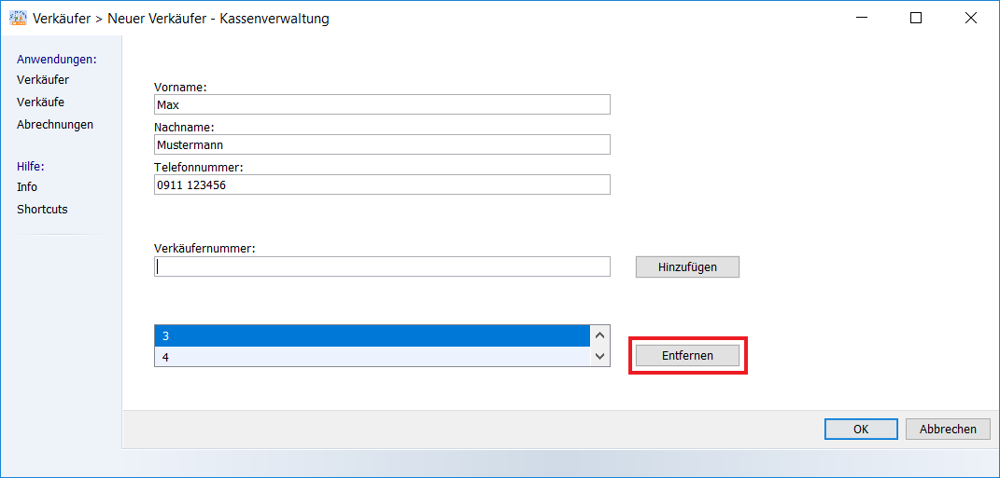

###Import und Export von Kundendaten

Um bereits erfasste Verkäufer von einem PC zu einem anderen PC zu übertragen kann man die Export-Funktion nutzen.
Die Verkäufer werden in einer Datei zusammengefasst und diese Datei am ausgewählten Ort gespeichert.

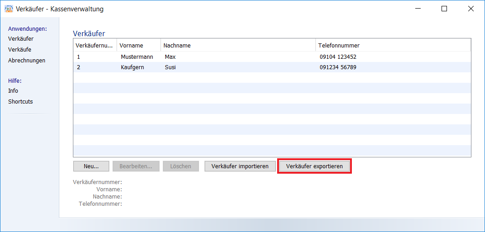

Es öffnet sich folgendes Fenster.

Nun gibt man seinen Dateinamen ein, wählt den Speicherort aus und bestätigt alles mit Klick auf „Speichern“.
Am Speicherort befindet sich nun eine „Dateiname.JSON“ Datei mit allen vorhandenen Verkäufern.
Diese Datei kann nun auf einen USB Stick gespeichert werden und an andere PC's gesteckt werden.

Um die vorher exportierten Verkäufer auf einen anderen PC zu übertragen kann hier die Import-Funktion genutzt werden.

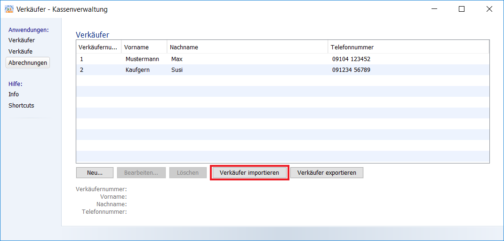

Es öffnet sich folgendes Fenster

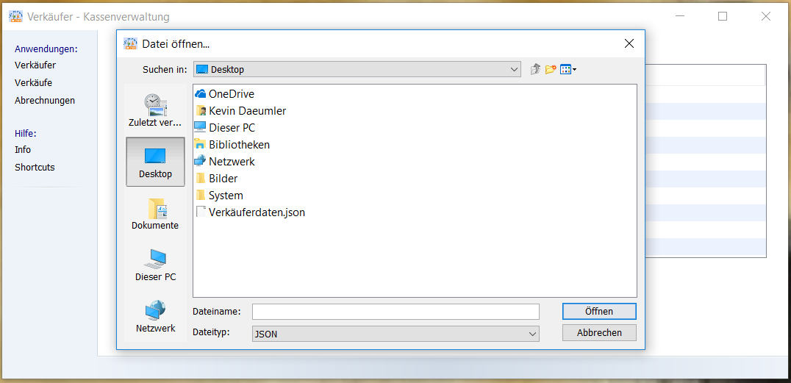

Hier sucht man auf dem USB Stick nach der vorher gespeicherten Dateiname.JSON Datei.
Klicken Sie auf die Datei und anschließend auf Öffnen 

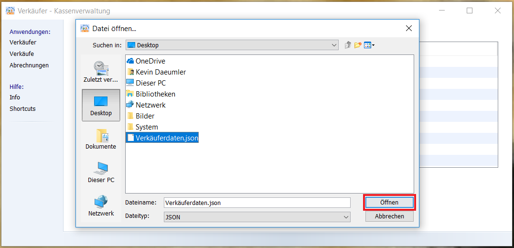

Die Daten werden importiert und der Benutzer erhält nach dem Import eine Benachrichtigung.

###Bearbeiten eines Verk&auml;ufers

Um einen bereits vorhanden Verkäufer zu bearbeiten, klickt man diesen an und klickt auf den Button „Bearbeiten“.

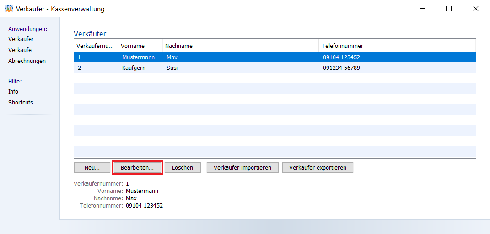

Es öffnet sich die Maske der "Neu Erfassung".

In dieser Maske besteht nun die Möglichkeit, den Namen, die Telefonnummer und die Verkäufernummern abzuändern oder zu ergänzen.

###Erfassung der Artikel

Um in die Artikelerfassung zu gelangen, benötigt es einen Klick auf "Verkäufe".
Alternativ kann man auch Strg + 2 (Steuerungstaste gedrückt halten und dann die 2 drücken) um in die Verkäufe Ansicht zu gelangen.

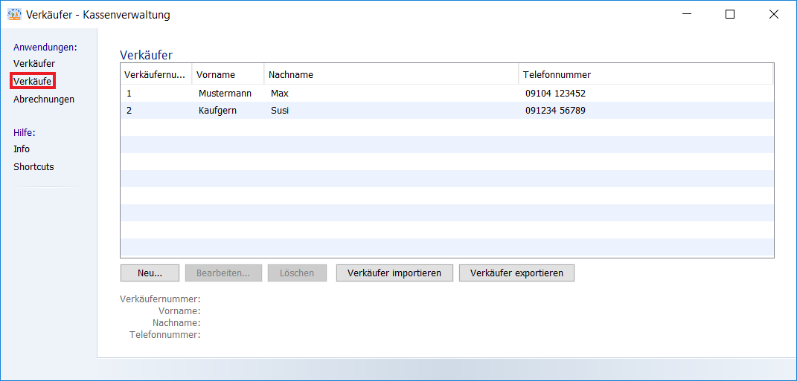

###Hinzuf&uuml;gen eines Artikels

Mit Klick auf „Neu“ öffnet sich eine neue Maske. 

Hier trägt man nun die Daten des jeweiligen verkaufes ein.
Mit der Tabulator taste (Die Taste links von Q mit den 2 Pfeilen) ist es hier möglich schneller in das nächste Feld zu wechseln.
Wurden alle Felder mit den jeweiligen Daten befüllt, fügt man mit Klick auf „Hinzufügen“ oder
mit dem betätigen der Entertaste den verkauften Artikel hinzu.
Danach können weiterhin beliebig viele Artikel erfasst werden.

Um den Verkauf abzuschließen benötigt es nur einen Klick auf „Verkauf abschließen“.

 **!Wichtig! klicken Sie erst auf Verkauf abschließen, wenn der Kunde gezahlt hat. 
Erst nachdem Sie auf Verkauf abschließen klicken werden ihre Einträge gespeichert. Wenn Sie zwischendrin auf abbrechen klicken 
sind ihre Einträge verworfen!**

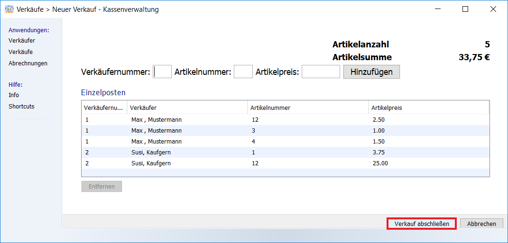

Ein Artikel kann entweder bei der Erfassung, oder im Nachhinein entfernt werden. Hierzu den jeweiligen Artikel anklicken und auf den „Entfernen“ Button Klicken.

Bevor der Artikel entfernt wird, fragt das Programm den Benutzer ob er diesen Artikel wirklich löschen möchte. Hier mit „Ja“ (der Artikel wird gelöscht) oder „Nein“ (der Artikel bleibt vorhanden) bestätigen.

###Import und Export von Artikeln

Ähnlich wie beim Import und Export von Verkäufern kann man auch Artikel importieren und exportieren

Um bereits erfasste Verkäufe von einem PC zu einem anderen PC zu übertragen kann man die Export-Funktion nutzen.
Die Verkäufe werden in einer Datei zusammengefasst und diese Datei am ausgewählten Ort gespeichert.

Mit einem Klick auf „Verkäufe Exportieren“ öffnet sich ein neues Fenster. 

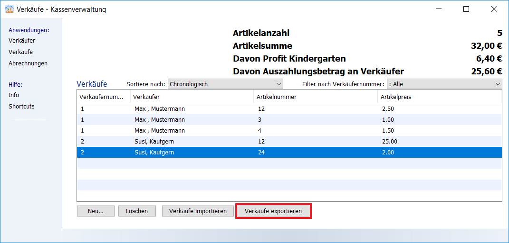

In diesem Fenster wählt man wieder den Speicherort aus, gibt der Datei einen Namen und schließt den Vorgang mit einem Klick auf „Speichern“ ab.

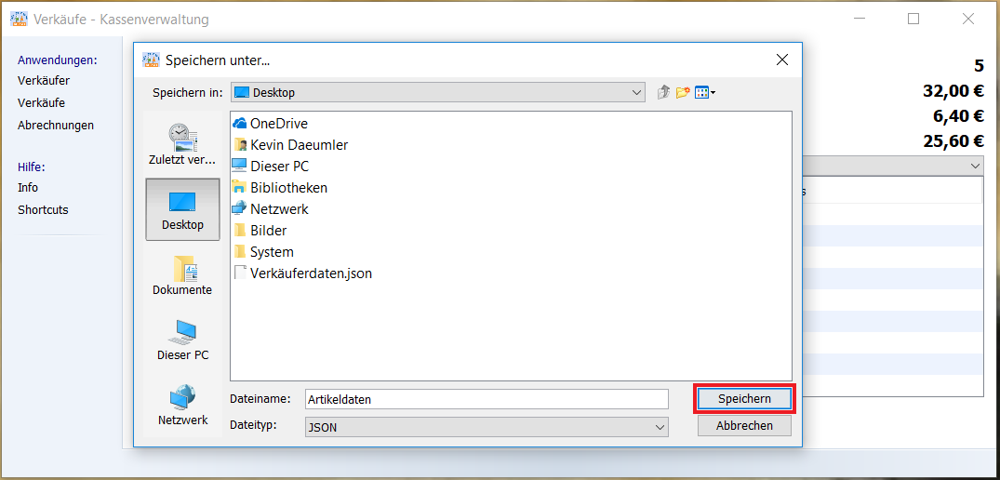

Am ausgewählten Ort wird eine Datei „Dateiname.JSON“ erstellt.

Mit Klick auf „Verkäufe Importieren“ öffnet sich ein neues Fenster. 

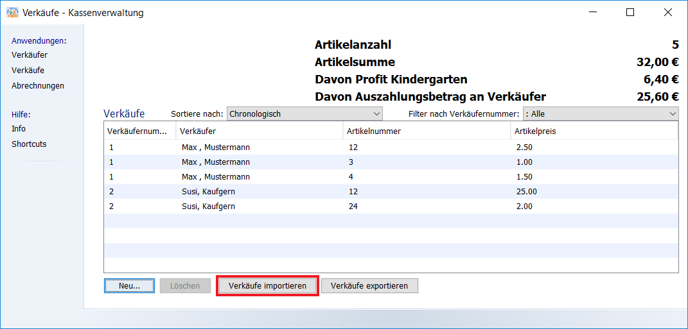

Es öffnet sich ein neues Fenster um die Datei auszuwählen.

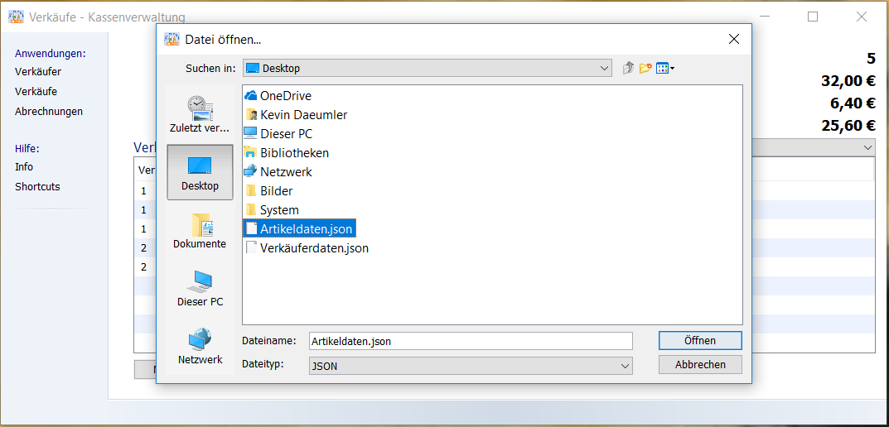

Nachdem an die passende Stelle navigiert wurde und die zu importierende Datei ausgewählt ist, beendet man den Vorgang mit einem Klick auf „Öffnen“.
Der Vorgang wird beendet und die Datensätze werden in der Artikelerfassung hinzugefügt.

###Sortieren und Filtern

Artikel können sortiert werden. Mit Klick auf „Sortiere Nach“ können die Artikel „Chronologisch“ oder 
„Nach Verkäufer und Verkäufernummer“ sortiert werden.

Artikel können nach Verkäufer gefiltert werden. Hierzu benötigt es einen Klick auf 
„Filter nach Verkäufernummer“. Hier werden nun alle Verkäufer in einem Dropdown aufgelistet, welche Artikel verkauft haben. Mit einem Klick auf den jeweiligen Verkäufer werden nur dessen Daten angezeigt. 

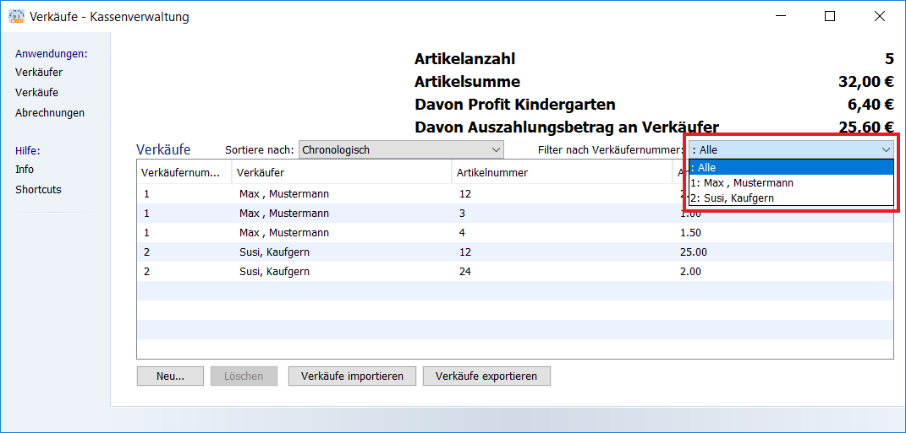

Um wieder alle Artikel sehen zu können, reicht ein Klick auf „Alle“.

###Abrechnung

Um in die Abrechnung zu gelangen, benötigt es einen Klick auf „Abrechnung“.
Alternativ kann man auch Strg + 3 (Steuerungstaste gedrückt halten und dann die 3 drücken) um in die Abrechnung Ansicht zu gelangen.

Hier werden in einer Tabelle alle gelisteten Verkäufer dargestellt.

###Abrechnungen drucken

Um eine einzelne Abrechnung zu drucken, wird der jeweilige Verkäufer selektiert und der Button „Abrechnung drucken“ geklickt.

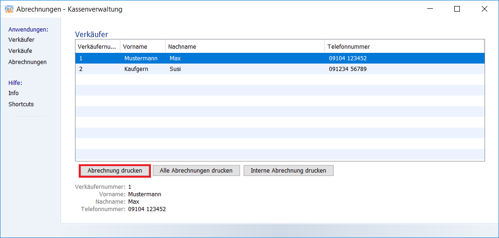

Nachdem Klick öffnet sich ein Dialog. Hier ist der Dateipfad beschrieben wo das Dokument gespeichert wurde.

###Alle Abrechnungen drucken

Um alle Abrechnungen zu drucken, benötigt es einen Klick auf „Alle Abrechnungen drucken“. Nach dem Klick öffnet sich ein Fenster, hier kann der Drucker ausgewählt werden.

Zusätzlich werden alle Rechnungen als PDF und Excel Datei in einem Ordner auf dem Desktop gespeichert.

###Interne Abrechnung drucken

„Interne Abrechnung drucken“ erstellt eine Datei in der alle Verkäufer mit ihren verkauften Artikeln aufgelistet sind. 

###Info

Ein Klick auf Info öffnet das Informationsfenster. 

Im Infofeld befinden sich die Kontaktdaten des Ansprechpartners und zusätzlich ein Link welcher die Hilfe Datei im Browser öffnet.

###Shortcuts

Um die Bedienung zu vereinfachen, befinden sich in der Anwendung folgende Shortcuts:

* Strg - 1 Ansicht Verkäufer
	* Wechselt in die Ansicht "Verkäufer"
* Strg - 2 Anischt Verkäufe
	* Wechselt in die Ansicht "Verkäufe"
* Strg - 3 Ansicht Abrechnungen
	* Wechselt in die Ansicht "Abrechnungen"
