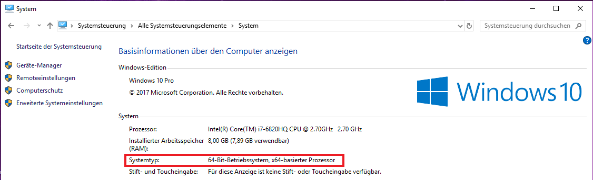
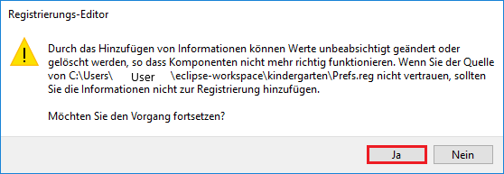
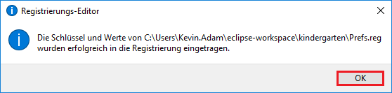
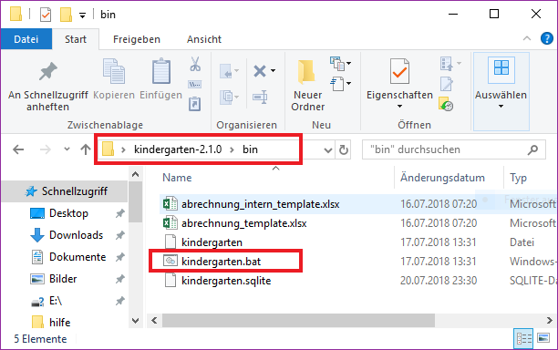

#Installationshinweise

  * [__Erste Schritte__](#erste-schritte)  
  * [__Java Runtime Environment installieren__](#java-runtime-environment-installieren)
  * [__Anwendung Starten__](#anwendung-starten)        
  * [__Benutzerhandbuch__](#benutzerhandbuch)

###Erste Schritte
Entpacken Sie die Datei kindergarten-2.1.0.zip mit einem Rechtsklick auf die Datei -> hier entpacken...
Der Ordner kindergarten-2.1.0 wird erstellt

###Java Runtime Environment installieren
Bevor Sie die Anwendung starten können müssen Sie die beigelegte Java Runtime Environment (JRE) installieren.
Dazu öffnen Sie den Ordner kindergarten-2.1.0 und darin den Ordner JRE.
Hier befinden sich 2 verschiedene Dateien : 32bit.exe und 64bit.exe
Sie dürfen  **Nur 1 von beiden ** verwenden.
Welche Sie brauchen entnehmen Sie aus der Systemsteuerung ihres PC's wie folgt beschrieben:

Öffnen Sie über den Windows-Button (früher "Start") die "Systemsteuerung".
Oder Tippen Sie in das Suchfeld neben dem Windows-Button "Systemsteuerung" ein.
Öffnen Sie den Reiter "System".
Hier bekommen Sie im ersten Absatz alle Infos zu Ihrem Betriebssystem aufgelistet, darunter auch die Windows-Version 32 Bit oder 64 Bit.

Unter Systemtyp:

Öffnen Sie hierzu den Ordner kindergarten-2.1.0 und darin den Ordner JRE.
Klicken Sie doppelt auf die Version die Sie brauchen und führen Sie die Installation durch.

Nachdem Sie die Installation erfolgreich beendet haben, machen Sie einen Doppelklick auf die Datei "Prefs.reg".
In der Registrierung Ihres Betriebssystems wird dadurch ein Schlüssel gesetzt der für das Benutzen der Anwendung notwendig ist.

Es öffnet sich folgendes Fenster:

Bestätigen Sie mit "Ja" es öffnet sich ein neues Fenster:

Bestätigen Sie mit "OK".

 **Alle oben genannten Punkte müssen nur bei der ersten Installation auf einem Gerät ausgeführt werden. 
							Möchten Sie das Programm erneut auf dem selben Gerät verwenden benötigen Sie keine erneute Installation 
              der JRE und auch keine erneute Ausführung der Prefs.reg Datei.**

Nach dem Sie die Installation wie bisher beschrieben durchgeführt haben können Sie die 
die Anwendung starten.

###Anwendung Starten

Um die Anwendung zu starten öffnen Sie den Ordner kindergarten-2.1.0 und navigieren über bin -> zur kindergarten.bat Datei
und klicken diese doppelt. Die Anwendung startet.

 **Achtung! Das schwarze Fenster welches sich hier gleichzeitig öffnet ist normal und notwendig.
						   Wenn Sie es schließen schließt sich auch die Anwendung daher lassen Sie es einfach im Hintergrund geöffnet.**

###Benutzerhandbuch
Eine Anleitung zur Bedienung der Anwendung finden Sie
unter kindergarten-2.1.0 -> hilfe -> Benutzerhandbuch.html oder klicken Sie auf [Benutzerhandbuch](pics/Benutzerhandbuch.html).
